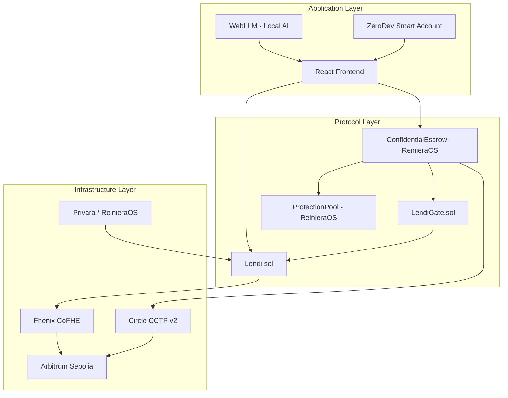
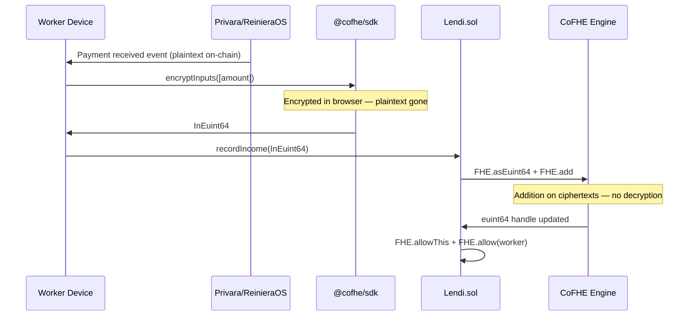
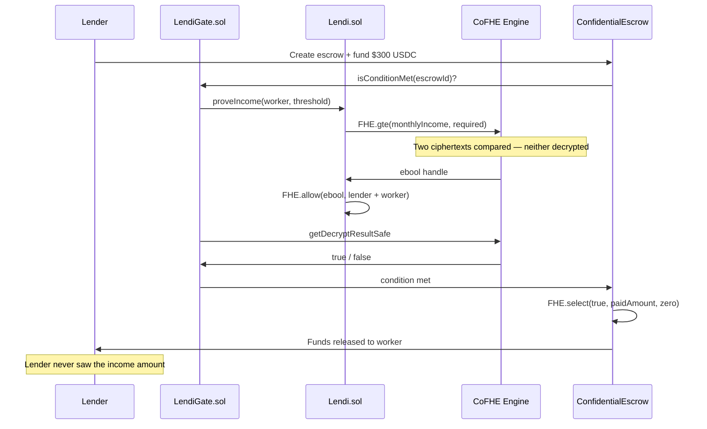
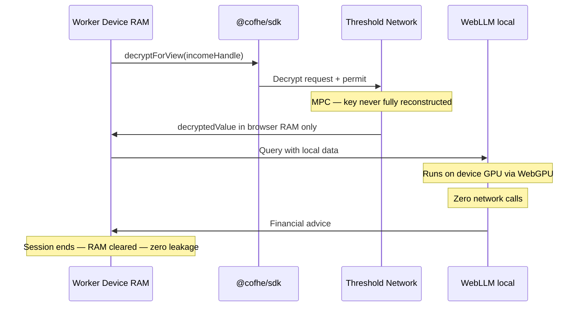
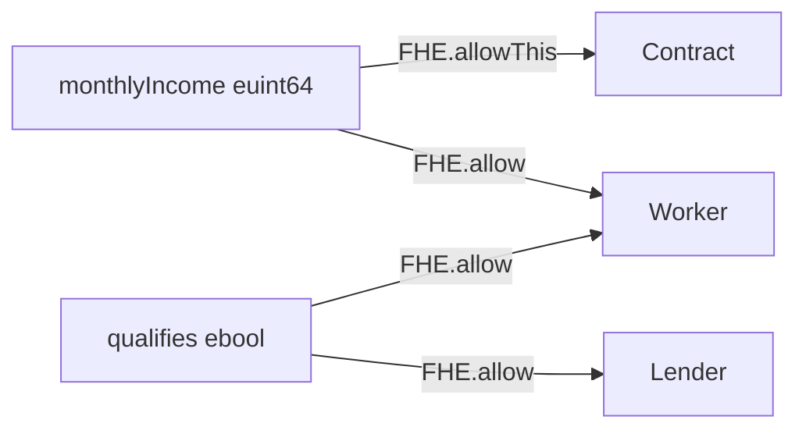

# Lendi Technical Architecture

---

## System Overview



---

## Income Recording Flow



---

## Credit Verification Flow



---

## AI Advisor Flow



---

## ACL Model



Nobody else can decrypt anything. Not the protocol. Not the public.

---

## Core Contracts

### Lendi.sol

```solidity
// SPDX-License-Identifier: MIT
pragma solidity ^0.8.24;

import {FHE, euint64, InEuint64, ebool} from "@fhenixprotocol/cofhe-contracts/FHE.sol";

contract Lendi {
    mapping(address => euint64) private monthlyIncome;
    mapping(address => bool)    public  registeredWorkers;
    mapping(address => bool)    public  registeredLenders;
    mapping(bytes32 => address) public  escrowToWorker;
    mapping(bytes32 => uint64)  public  escrowToThreshold;

    function recordIncome(InEuint64 calldata encAmount) external onlyWorker {
        euint64 amount = FHE.asEuint64(encAmount);
        monthlyIncome[msg.sender] = FHE.add(monthlyIncome[msg.sender], amount);
        FHE.allowThis(monthlyIncome[msg.sender]); // MANDATORY — #1 bug if forgotten
        FHE.allow(monthlyIncome[msg.sender], msg.sender);
    }

    function proveIncome(
        address worker,
        uint64  threshold
    ) external onlyLender returns (ebool) {
        euint64 required  = FHE.asEuint64(threshold);
        ebool   qualifies = FHE.gte(monthlyIncome[worker], required);
        FHE.allow(qualifies, msg.sender); // lender sees result
        FHE.allow(qualifies, worker);     // worker sees result
        return qualifies;
    }
}
```

### LendiGate.sol

```solidity
// Plugs into ReinieraOS as IConditionResolver
contract LendiGate is IConditionResolver {
    function isConditionMet(bytes32 escrowId) external returns (bool) {
        address worker    = informalProof.escrowToWorker(escrowId);
        uint64  threshold = informalProof.escrowToThreshold(escrowId);
        ebool   qualifies = informalProof.proveIncome(worker, threshold);
        (uint256 result, bool valid) = FHE.getDecryptResultSafe(qualifies);
        require(valid, "Not ready");
        return result == 1;
    }
}
```

---

## Technology Stack

| Layer | Technology | Purpose |
|---|---|---|
| Smart contracts | Solidity 0.8.24 | Core FHE logic |
| FHE library | `@fhenixprotocol/cofhe-contracts` | `euint64`, `ebool`, operations |
| Client SDK | `@cofhe/sdk` — not deprecated cofhejs | Encrypt, decrypt, permits |
| Payment rails | `@reineira-os/sdk` | Income capture, escrow, settlement |
| On-chain reads | `viem` | USDC Transfer event fallback |
| AI advisor | `@mlc-ai/web-llm` | Local LLM, zero data leakage |
| Frontend | React + `@cofhe/react` | Worker + lender UI |
| Accounts | ZeroDev (Wave 2) | Social login, sponsored gas |
| Testing | Hardhat + `@cofhe/hardhat-plugin` | Mock FHE locally |
| Network | Arbitrum Sepolia -> public mainnet -> Fhenix mainnet (autumn 2026) | Phased deployment |

---

## Critical Rules

> ⚠️ `FHE.allowThis()` is mandatory after every FHE mutation. Forgetting it is the #1 bug.

> ⚠️ No `if/else` on encrypted values. Use `FHE.select()` instead.

> ⚠️ `evmVersion: 'cancun'` required in `hardhat.config.ts`.

> ⚠️ Use `@cofhe/sdk`, not deprecated `cofhejs`.

---

*Lendi | Fhenix CoFHE | Privara + ReinieraOS*
