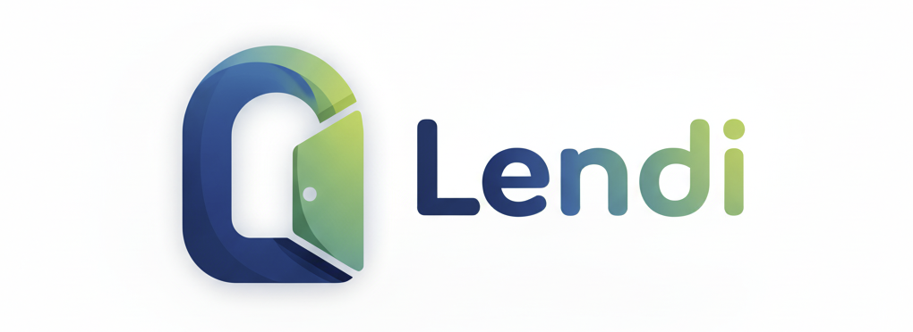

# Lendi
### Prove what you earn. Reveal nothing.

---

## What We Do

Lendi lets informal workers prove their income to lenders using Fully Homomorphic Encryption — without revealing the actual number. The lender receives a yes/no answer. The worker keeps full privacy. Every loan is insured via an encrypted protection pool — the only system in LATAM that protects lenders without exposing borrower data.

---

## The Problem

**1. Exclusion by design**
47 million workers in LATAM earn real income in stablecoins but have no payslip. Traditional lenders and P2P platforms require full financial exposure to underwrite them. Most workers refuse. They stay excluded.

**2. Privacy is the blocker — not the technology**
On-chain income data exists and is verifiable. The problem is that sharing it means revealing everything: clients, amounts, sources. No existing solution separates "proof of income" from "exposure of income."

**3. The informal economy is going on-chain**
Stablecoin adoption in LATAM grew 63% YoY. Workers are already paid in USDC. The data is there. The privacy layer is not.

---

## Our Solution

**1. Encrypted income accumulation**
Workers register income from on-chain stablecoin transfers (Privara / direct USDC). Each amount is encrypted client-side and stored as `euint64` on Arbitrum. Nobody — including the protocol — can read the number.

**2. Privacy-preserving credit proof**
When a lender requests verification, the contract runs `FHE.gte(workerIncome, threshold)` on two ciphertexts. Neither value is decrypted. The lender receives only an `ebool`: qualifies or not.

**3. Lender protection via encrypted risk pool**
Every loan is automatically backed by a ProtectionPool that insures lenders against default — using FHE to calculate premiums and payouts without exposing individual worker risk scores. This is our only feature that no competitor has. Lenders get coverage. Workers get privacy. The pool operates entirely on encrypted data.

**4. Local AI financial advisor**
Workers can chat with an AI advisor that sees their decrypted income — but only in their device's RAM, via WebLLM. No server is ever called. Not ours, not OpenAI's.

---

## Why Now, Why Us

**Why now**
FHE on EVM became production-ready in 2025. Fhenix CoFHE is live on Arbitrum Sepolia. The window for first-mover advantage is open — and it closes as protocols ossify.

**Why us**
- We are building from Colombia — one of the top informal economies in LATAM, with 19M+ digital wallet users (Nequi alone)
- We have a co-build agreement with ReinieraOS (Privara ecosystem) for payment rails, escrow infrastructure, and VC introductions
- We are one of two teams in this buildathon addressing consumer use cases outside of DeFi/trading

---

## Market Size

| | Size | Basis |
|---|---|---|
| **TAM** | $12B | P2P + microlending market in LATAM (2025) |
| **SAM** | $800M | Colombia + Mexico informal worker lending |
| **SOM (Year 1)** | $2M | 5,000 loans via one fintech partner in Colombia |

The $2M SOM assumes: one fintech integration (Nequi or Rappi), average loan of $400, 5,000 loans in year one. This is the realistic starting point — not a region-wide figure.

---

## Competitors

| | Privacy | Works without payslip | On-chain | Lender protection |
|---|---|---|---|---|
| **Lendi** | ✅ FHE | ✅ | ✅ | ✅ via pool |
| **Kueski (MX)** | ❌ | ✅ | ❌ | ❌ |
| **Addi (CO)** | ❌ | Partial | ❌ | ❌ |
| **Juancho te Presta (CO)** | ❌ | ✅ | ❌ | ❌ |
| **Bloom Credit** | ❌ | Partial | ❌ | ❌ |
| **ConfidentialCredit (Fhenix)** | ✅ FHE | ✅ | ✅ | ❌ |

**Honest note:** Kueski, Addi, and Juancho te Presta already serve informal workers. They have distribution, trust, and a working product. Our advantage is not that we serve informal workers — it's that we do it without holding their data **and we protect lenders without exposing borrowers**.

**Lender protection is our moat.** No competitor — traditional or crypto-native — offers insurance against default while keeping borrower income encrypted. This is a regulatory advantage (no data liability), a trust advantage (lenders get coverage), and a technical advantage (only possible with FHE). We are not faster or simpler than Addi. We are more defensible.

---

## One-Year Roadmap

| Quarter | Focus | Target |
|---|---|---|
| **Q2 2026** | Ship core FHE contracts + demo | Arbitrum Sepolia deployment |
| **Q2 2026** | AI advisor + Privara integration | First 100 test users (Colombia) |
| **Q3 2026** | Public testnet validation | One fintech pilot (Nequi or Rappi Colombia) |
| **Q3 2026** | Plug in Fhenix privacy layer | Protocol-level privacy on public chain |
| **Q4 2026** | Mainnet (Fhenix, scheduled autumn 2026) | First 1,000 loans |

**Note:** Fhenix mainnet is not available until autumn 2026. We start on a public chain to validate product-market fit, then plug in privacy at the protocol level with Fhenix support.

---

## Built With

Fhenix CoFHE · `@cofhe/sdk` · Privara + ReinieraOS · Arbitrum Sepolia · WebLLM · React

---

*Wave 1 — Fhenix Privacy-by-Design Buildathon · March 2026*
